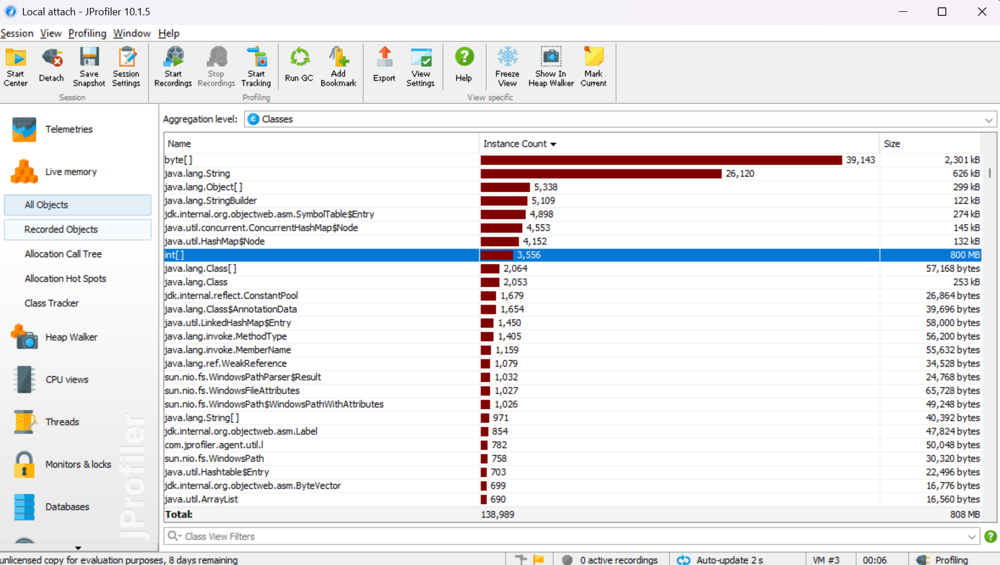
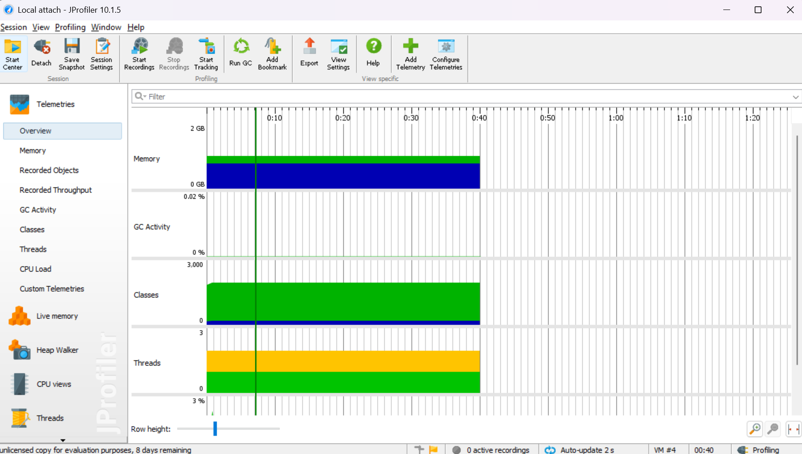
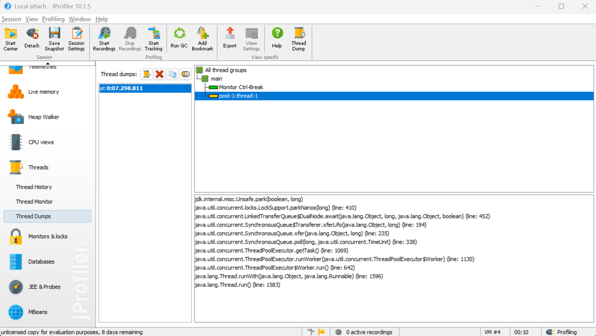

# JProfiler Memory & Thread Analysis Report

## Overview
This document summarizes the usage of **JProfiler** to analyze memory usage, detect memory leaks, and inspect thread states in a Java application using the file `test.java`.

---

## Java Class Under Test

```java
public class test {
    String name;
    int age;

    test(String name, int age) {
        this.name = name;
        this.age = age;
    }

    public void displayInfo() {
        System.out.println("Name: " + name);
        System.out.println("Age: " + age);
    }

    public static void main(String[] args) {
        test person1 = new test("Alice", 25);
        person1.displayInfo();
    }
}
```

---

## JProfiler Observations

### 1. Live Memory (HeapDump.png)


- `int[]` instances: **3,556** consuming **800 MB**
- `byte[]` and `String` also had high instance counts
- Possible memory leak indicated by large retained size and high instance count

### 2. Memory Graph & GC Activity (Overview.png)


- Memory usage is stable around **2 GB**
- **Garbage Collection activity is minimal (near 0%)**
  - Suggests objects are being retained and not eligible for GC

### 3. Thread Dump (ThreadDump.png, ThreadDump(Main).png)

.png)

- Thread `pool-1-thread-1`: Waiting on `LinkedTransferQueue`
- `main` thread: Blocked on `SocketDispatcher.read` (I/O wait)
- No deadlocks found, but potential performance bottleneck in waiting threads

---

## How to Detect Memory Leaks with JProfiler

### Step-by-Step:
1. Attach JProfiler to your Java process
2. Navigate to **Live Memory > All Objects**
3. Sort by **Size** or **Instance Count**
4. Look for unusually large usage (e.g., `int[]`, `Object[]`)
5. Click on class → **"Show in Heap Walker"**
6. Use:
   - **Incoming References** to see who is retaining the object
   - **Allocation Call Tree** to trace creation point

### When to Suspect a Leak:
- Instance count keeps rising over time
- Large total retained size
- Low GC activity despite high memory use

---

## Thread Analysis

### When to Use Thread Dump:
- Application hangs or is unresponsive
- High CPU usage or thread contention

### How to Analyze:
1. Go to **Thread Dumps** in JProfiler
2. Observe the state of threads:
   - `RUNNABLE`: actively running
   - `WAITING/BLOCKED`: check what they are waiting on
3. Check stack traces to identify blocking calls or infinite loops

---

## Summary
| Feature            | Observation                         | Tool Used        |
|--------------------|--------------------------------------|------------------|
| Memory Leak        | `int[]` using 800 MB                | Live Memory, Heap Walker |
| GC Inactivity      | 0% GC activity                      | Telemetries      |
| Thread Blocking    | Thread in `LinkedTransferQueue`     | Thread Dump      |
| Main Thread Blocked| I/O wait on socket read             | Thread Dump      |

---

## Recommendations
- Investigate source of excessive `int[]` allocations
- Use Heap Walker to identify reference chains
- Optimize or release unused objects
- Monitor long-waiting threads in executors

---

## Additional Suggestions
Would you like an example of an actual memory leak to simulate and analyze with JProfiler?
We can also provide a test project setup with a leak scenario.